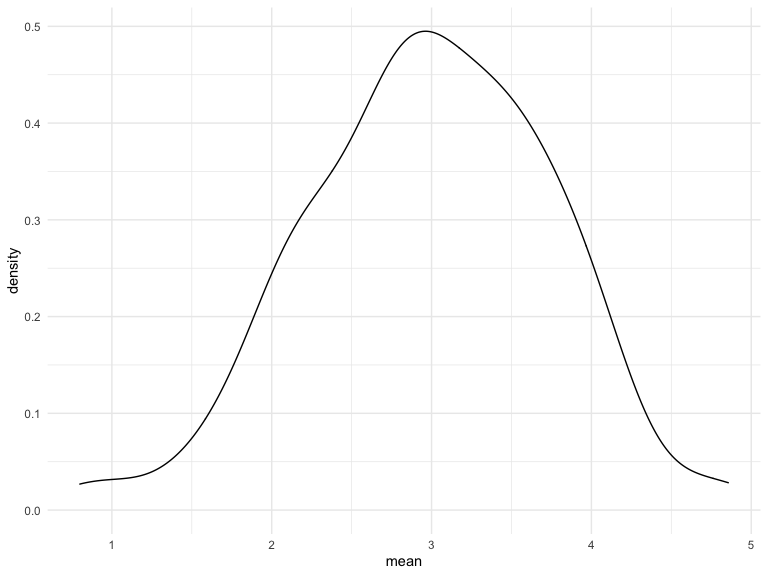
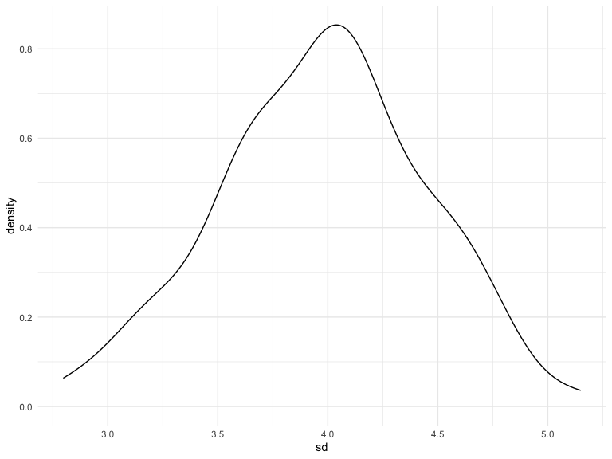

Writing Functions
================
Yue Liu
2020-11-11

``` r
sim_mean_sd = function(samp_size, mu = 3, sigma = 4){
  
  sim_data = 
    tibble(
      x = rnorm(n = samp_size, mean = mu, sd = sigma) 
    )

  sim_data %>% 
    summarize(
      mean = mean(x),
      sd = sd(x)
    )
}
```

I can “simulate” by running this line.

``` r
sim_mean_sd(30)
```

    ## # A tibble: 1 x 2
    ##    mean    sd
    ##   <dbl> <dbl>
    ## 1  4.29  4.45

## Let’s simulate a lot

Let’s start with a for loop

``` r
output = vector("list", length = 100)

for (i in 1:100){
  
  output[[i]] = sim_mean_sd(samp_size = 30)
  
}

bind_rows(output)
```

    ## # A tibble: 100 x 2
    ##     mean    sd
    ##    <dbl> <dbl>
    ##  1  3.35  4.23
    ##  2  3.86  4.03
    ##  3  3.78  4.61
    ##  4  2.85  3.43
    ##  5  2.74  4.01
    ##  6  3.12  3.95
    ##  7  3.77  4.46
    ##  8  4.55  4.72
    ##  9  2.45  3.47
    ## 10  3.61  3.78
    ## # … with 90 more rows

Lets’s use a loop function

``` r
sim_results = 
  rerun(100, sim_mean_sd(samp_size = 30)) %>%  # rerun 100 times
  bind_rows() # each run will give different results
# can use set.seed to generate the same results 
```

Let’s look at results…

``` r
sim_results %>% 
  ggplot(aes(x = mean)) + geom_density()
```



``` r
sim_results %>% 
  ggplot(aes(x = sd)) + geom_density()
```



``` r
sim_results %>% 
  summarize(
    avg_samp_mean = mean(mean),
    sd_samp_mean = sd(mean)
  )
```

    ## # A tibble: 1 x 2
    ##   avg_samp_mean sd_samp_mean
    ##           <dbl>        <dbl>
    ## 1          3.01        0.859
